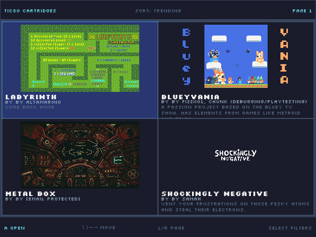
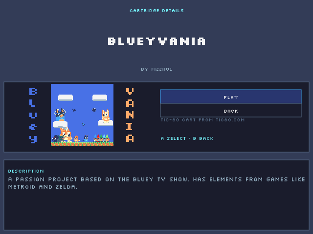

# Launcher [tic80.com](http://tic80.com) for retro-consoles

 - its not a offical port
 - support non browser platforms
 - run homebrew games runs with libretro

|  |  | 
| :-: | :-:|

## How to build

> **Note:** This project is a lab environment using the **develop** version of the [Gly Engine](https://github.com/gly-engine/gly-engine). Its `package.json` and `tsconfig.json` **are not intended as production examples**.

```
npm install
```

```
npm run build
```

## How to config R36S

create an file `/roms/ports/tic80.sh`

```
#! /bin/sh
./tic80/core.armv7 --toml ./tic80/config.toml
```

create an file `roms/ports/tic80/config.toml` and put files: `main.lua` `game.lua` `core.armv7`

```toml
[args]
plugins = [
    "tic80/plugins/liblibretro_gecnd.so
]
```